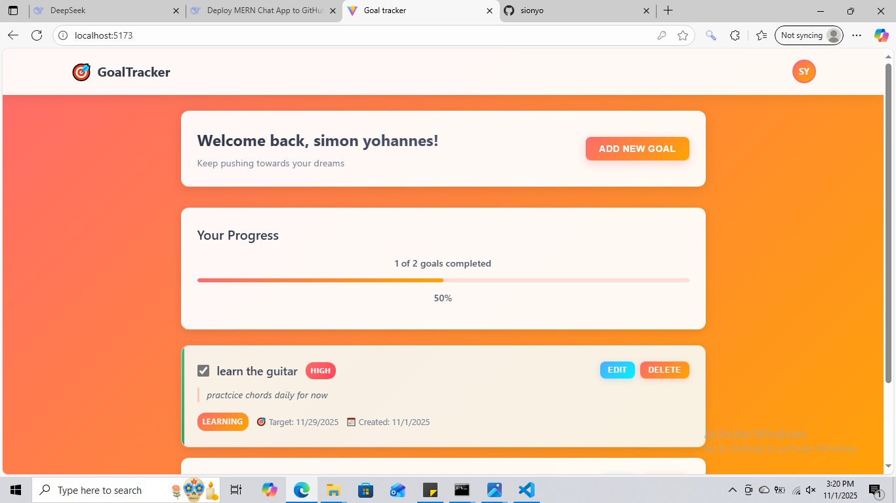

**Goal Tracker - MERN Stack Application**
A full-stack web application built with the MERN stack (MongoDB, Express.js, React, Node.js) to help users set, track, and achieve their personal goals. Features a clean, intuitive interface for managing your objectives and monitoring progress.

**Features**
 **Create & Manage Goals** - Add, edit, and delete your personal goals

 **Progress Tracking** - Monitor completion status with visual indicators

 **User Authentication** - Secure signup and login system

 **Due Date Tracking** - Set and track goal deadlines

 **Responsive Design** - Works perfectly on desktop and mobile devices

  **Intuitive UI** - Clean and user-friendly interface

**Tech Stack**
**Frontend:**

React js

Context API (State Management)

Axios for API calls

CSS3 with modern styling

**Backend:**

Node.js

Express.js

MongoDB with Mongoose

JWT Authentication

bcrypt for password hashing

env
REACT_APP_API_URL=http://localhost:5000
